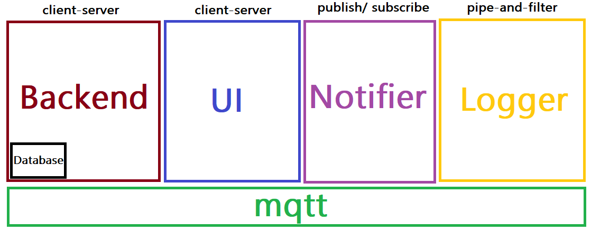

# Group 7

# Table of contents
1. [Purpose](#purpose)
    1. [What](#what)
    2. [Why](#why)
    2. [How](#how)
2. [Requirements (SRS)](#requirements)
3. [Architecture (SAD)](#architecture)
4. [Developers](#developers)

## Purpose 
### What are you going to make? 
We will build a web-application that allows citizens of Gothenburg to book dentist appointments. 
The application will display a map that the user can navigate and find dentist offices.
In the application the user can choose among different dentist offices to book appointments at. 

### Why will you make it? 
There is a real demand for this kind of system and as of now there is no available system that 
provides users the opportunity to select from various dentist offices in their area.

### How are you going to make it? 
We will build a distributed web-application powered by Node.js and Express using the MQTT-protocol. 

## Requirements (SRS) 
[Requierments](/Requirements.md)

[User stories](/UserStories.md)

## Architecture (SAD) 

## Developers 

- [Clementine Jensen](https://github.com/clementinejensen)
- [Christian O'Neill](https://github.com/Brother-Blue)
- [Hjalmar Thunberg](https://github.com/Hjalmar-Thunberg)
- [Hugo Hempel](https://github.com/HugoHempel)
- [Linus Ivarsson](https://github.com/linusivarssons)
- [Linus Åberg](https://github.com/LinusAaberg)

