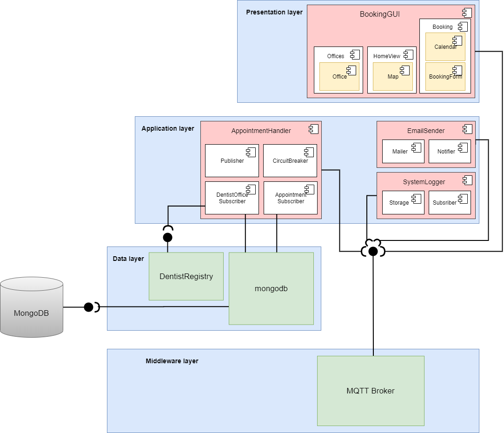

# Group 7

# Table of contents
1. [Purpose](#purpose)
    1. [What](#what)
    2. [Why](#why)
    3. [How](#how)
    4. [[Developers]](#developers)
2. [Requirements (SRS)](#requirements)
3. [Architecture (SAD)](#architecture)
4. [Project Management Report (PMR)](#pmr) 
5. [Developers](#developers)

## Purpose 
### What are you going to make? 
We will build a web-application that allows citizens of Gothenburg to book dentist appointments. 
The application will display a map that the user can navigate and find dentist offices.
In the application the user can choose among different dentist offices to book appointments at. 

### Why will you make it? 
There is a real demand for this kind of system and as of now there is no available system that 
provides users the opportunity to select from various dentist offices in their area.

### How are you going to make it? 
We will build a distributed web-application powered by Node.js and Express using the MQTT-protocol.

## Developers 

- [Clementine Jensen](https://git.chalmers.se/jensenb)
- [Christian O'Neill](https://git.chalmers.se/oneillc)
- [Hjalmar Thunberg](https://git.chalmers.se/hjathu)
- [Hugo Hempel](https://git.chalmers.se/hugohe)
- [Linus Ivarsson](https://git.chalmers.se/ilinus)
- [Linus Åberg](https://git.chalmers.se/linusab)

## Requirements (SRS) 
[Requierments](/Requirements.md)

[User stories](/UserStories.md)

## Architecture (SAD) 

#### Component diagram:

#### Architectural Styles diagram:

The Circuit Breaker which can be seen above the Appointment Handler was added as fault tolerance mechanism to measure the load. 
The reason it is in the appointment handler is due to this being the component with the largest amount of traffic.

#### Functional functional decomposition diagram:

Our Architecture for the system:

The system will consist of four different components. 
* AppointmentHandler that will take care of the database handling. This is where we will store information about dentist offices and appointments.

* BookingGUI is the part that our users get in contact with which will contain a map view of Gothenburg that show available time-slots at different dentists. The GUI will let the user book appointments at dentist offices with open time-slots.

* EmailSender that will handle email-conformations and other notifications from the system.

* SystemLogger that handles the logging of previous events to increase our traceability within the system. 

The components mentioned above will mostly communicate through Publish/Subscribe via MQTT. All communications will be handled through a MQTT broker before it is sent to the subscribers. 

As the project moves along this architecture and description will expand and change.

## Project Management Report (PMR) 
In this project endevour the team will follow an agile development process. The team will, once a week, together derive a certain set of user stories from bigger requirements that will be implemented the coming week. During the working week the team is divided up into smaller teams, Frontend, Backend, and if necessary Architecture. The members of each team will change every week in order to deepen the learning. The team will further make use of a Kanbanboard hosted at Trello where work will be distributed in an pull approach. 

The whole team will meet up three times a week. Monday and Friday, its just the team that meets and on Wednesday it is a meeting with the team and the Product Owners (TAs and Teachers).
* The purpose of Monday meetings is to derive more User Stories if there is velocity for it and also discuss requirements changes that might have com up during the weekend.
* The purpose of the Thursday meetings is to report work progress to Product Owner and to receive feedback on the product at hand.
* The purpose of the Friday meeting is to discuss the work that has been done during the week and to get a collective vision of where we are in the development.

Furthermore the team has agreed on a code of conduct which can be found [here](/TeamContract.md)

